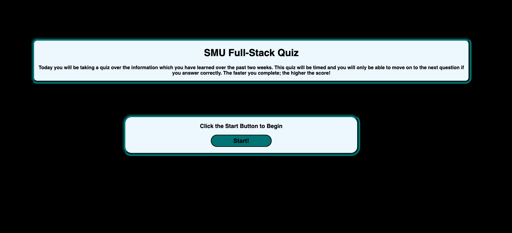
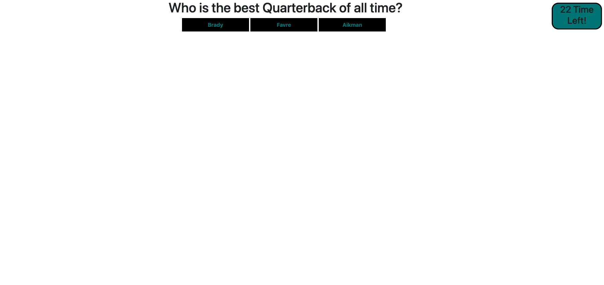

# Pop_Quiz

Introduction: To display the users knowledge of football and HTML this UI allows the user to answer questions as quickly as they can. If the answer is right you get a point and move to the next question. If the question is wrong you are not awarded a point and 5 seconds is removed from the clock. Faster user get the honor of entering their initials into HTML quiz history!

Technologies used:
o HTML
o CSS
o JavaScript

